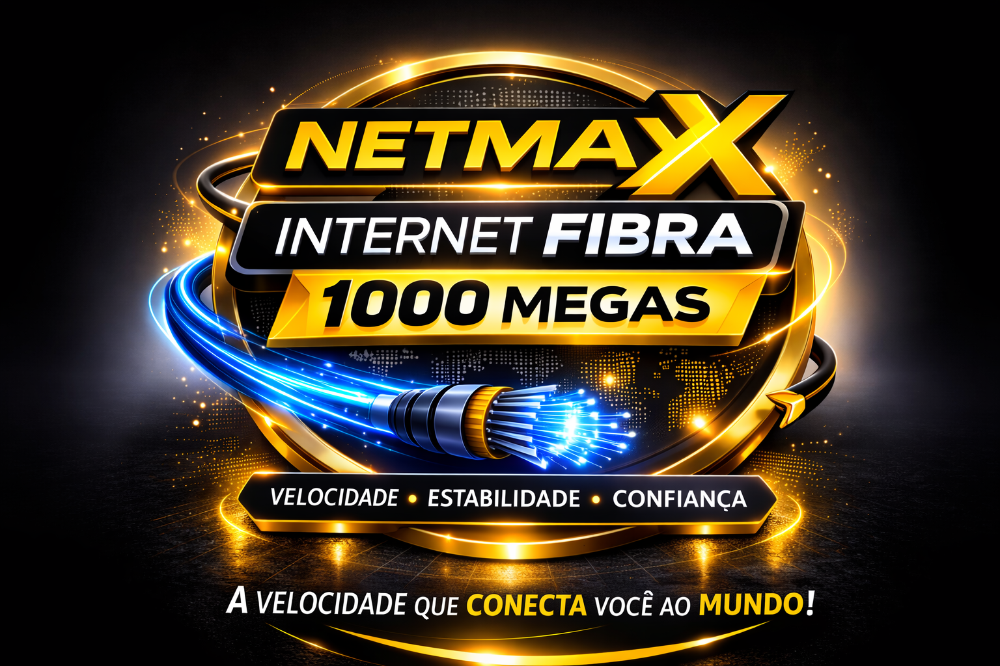

========================================================================================================================================================================
========================================================================================================================================================================
# Netmax Fibra - Website Rebuilt (Bootstrap Edition)

Este projeto consiste na reconstrução completa do portal institucional da **Netmax Fibra**. O site foi modernizado utilizando Bootstrap 5, garantindo total responsividade e uma interface de usuário otimizada, mantendo a identidade visual clássica da marca.

## 🎨 Identidade Visual
- **Cor Primária:** #FFD000 (Amarelo Netmax)
- **Cor Secundária:** #000000 (Preto)
- **Tipografia:** Segoe UI / Arial

## 🛠️ Tecnologias Utilizadas
- **HTML5:** Estrutura semântica.
- **CSS3:** Estilizações personalizadas e animações de pulsação.
- **JavaScript (Vanilla):** Lógica de modais e integração com WhatsApp.
- **Bootstrap 5:** Sistema de grid, utilitários e componentes responsivos.
- **Font Awesome 6:** Ícones vetoriais.

## 📂 Estrutura de Arquivos
- `/index.html`: Página principal com planos e benefícios.
- `/netmax_tv.html`: Página dedicada ao serviço de TV com modais de ativação.
- `/estante_digital.html`: Detalhes do benefício de livros.
- `/jornalz.html` & `/news_periodicos.html`: Portais de conteúdo.
- `/nosso_proposito.html` & `/por_que_escolher_a_netmax.html`: Páginas institucionais.
- `/assets/css/styles.css`: Estilos customizados e overrides do Bootstrap.
- `/assets/js/script.js`: Comportamento dinâmico.

## 🚀 Como Executar
Basta abrir o arquivo `index.html` em qualquer navegador moderno. Não é necessário servidor backend, pois o site é estático.

---
*Desenvolvido para Netmax Fibra - Conectando você ao mundo.*
========================================================================================================================================================================
========================================================================================================================================================================


# 📡 NETMAX FIBRA - O Site que é Mais Rápido que Nossa Internet (Quase)


## 🚀 Bem-vindo ao Repositório Mais Rápido da Cidade de Siqueira Campos

E aí, dev! Se você chegou até aqui, provavelmente está tão perdido quanto um usuário na página 404... falando nisso, temos uma das melhores páginas de erro da história (sério, tem um botão de surpresa e tudo). Mas vamos ao que interessa:

## 📦 O que tem nessa bagaça?

Este é o repositório oficial do site da **Netmax Fibra**, a internet que é tão rápida que às vezes o site carrega antes do clique terminar. Aqui você encontrará:

- Uma **página inicial** que vai te fazer querer assinar 1000 megas (R$ 114,90, já viu?)
- A **Estante Digital** - porque ler é bom, e ler de graça é melhor ainda
- O **JornalZ** - para você ficar por dentro das fofocas... digo, notícias
- A **Netmax TV** - mais de 100 canais e zero fios pela casa (adeus, emaranhado de cabos)
- O **NEWS Periódicos** - para você fingir que é intelectual lendo artigos acadêmicos
- **Nosso Propósito** - a história de três irmãos que sonharam grande (e acordaram com uma empresa de internet)
- **Por que escolher a Netmax** - se você ainda não se convenceu, essa página é pra você
- Uma **página 404** tão divertida que dá vontade de errar o URL de propósito

## 🛠️ Tecnologias Usadas

```
HTML5    = 90% de orgulho, 10% de <div> esquecida
CSS3     = Gradientes até no café da manhã
JavaScript = Só o básico, mas com muito amor
FontAwesome = Ícones bonitinhos sem pagar nada
Simple Icons = Redes sociais sem complicação
```

## 🎨 Identidade Visual

- **Amarelo** (#FFD000) = A cor do dinheiro... brincadeira, é a cor do sucesso
- **Laranja** (#f24f00) = Fogo, paixão, e aquele preço promocional que arde no bolso da concorrência
- **Preto** (#000000) = O novo padrão de elegância (e combina com tudo)

## 📁 Estrutura de Pastas (pra não se perder)

```
netmax-site/
├── index.html                    # A porta de entrada pro paraíso da fibra
├── 404.html                      # Onde os URLs perdidos encontram um lar
├── README.md  
├── assets/
│   ├── css/
│   │   └── styles.css            # 2000 linhas de pura estilização (amém)
│   ├── js/
│   │   └── script.js             # A mágica acontece aqui
│   └── images/
│       ├── logos/                 # Logos pra todo lado
│       │   ├── logo_netmax.JPG
│       │   ├── logo_netmaxFIBRA.png
│       │   ├── logo_netmaxTV.png
│       │   ├── logo_digi_livro.png
│       │   ├── logo_estante_virtual.png
│       │   └── logo_jornalz.png
│       └── banners/               # Banners bonitões
│           ├── internet_banner.png
│           └── netmaxtv_banner.png
└── pages/
    ├── estante_digital.html      # Livros, livros e mais livros
    ├── jornalz.html               # Notícias sem sensacionalismo (prometo)
    ├── netmax_tv.html             # TV que não precisa de antena
    ├── news_periodicos.html       # Para os inteligentes
    ├── nosso_proposito.html       # #MKT emocional
    └── por_que_escolher_a_netmax.html  # Autoexplicativo
```

## 🚦 Como rodar localmente

1. Clone o repositório
   ```bash
   git clone https://github.com/netmaxfibra/site.git
   ```
2. Abra o arquivo `index.html` no seu navegador
3. Pronto! (Não precisa de servidor, npm, node_modules, webpack, nem rezar pra compilar)

## 🎭 Easter Eggs

- Clique no botão surpresa da página 404 (vai, eu sei que você quer)
- O contador regressivo na página inicial é falso? Só acessando pra saber
- Passe o mouse no botão do WhatsApp (ele fala com você)

## 📞 Contato do Desenvolvedor (o gênio por trás disso)

**Rodrigo Barbosa**  
📅 23/02/2026 (sim, eu sou do futuro)  
💻 Desenvolvedor que manja das paradas

## 📝 Licença

Todos os direitos reservados à Netmax Fibra - Se copiar, a gente te desconecta (brincadeira, mas respeita o trampo alheio, né?)

---

**Netmax Fibra** - A velocidade que conecta você ao mundo e ao conhecimento.  
*Desenvolvido com 💛 para nossos clientes (e para os devs curiosos que leram até aqui)*

---

<p align="center">
  
  <br>
  <sub>Se você leu até o final, ganha um livro na Estante Digital (só clicar lá no site).</sub>
</p>
