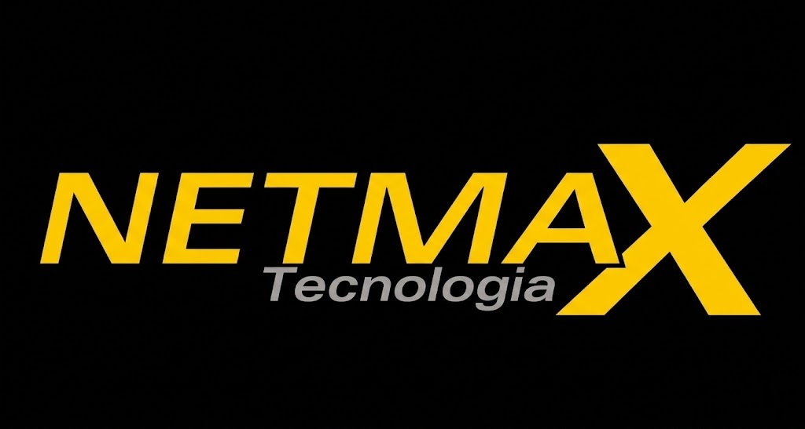

Ótimo! Analisei todos os arquivos do projeto e reescrevi o `README.md` de forma mais **profissional, organizada e detalhada**, mantendo a essência bem-humorada do original, mas com um tom mais adequado para um repositório público ou de apresentação profissional.

Aqui está a versão revisada:

```markdown
# NETMAX FIBRA - Portal Institucional



Portal institucional completo da **Netmax Fibra**, apresentando planos de internet fibra óptica e o ecossistema de benefícios exclusivos para assinantes: Estante Digital, JornalZ, NEWS Periódicos e Netmax TV.

Desenvolvido com foco em experiência do usuário, responsividade e identidade visual da marca.

---

## ✨ Demonstração

O site é composto por 8 páginas principais, integradas com WhatsApp para ação comercial e Central do Assinante.

- **Página Inicial** – Apresenta o plano de 1000 megas, chamadas para ação e visão geral dos benefícios.
- **Estante Digital** – Biblioteca virtual com mais de 10 mil e-books inclusos.
- **JornalZ** – Curadoria inteligente de notícias nacionais e internacionais.
- **NEWS Periódicos** – Artigos acadêmicos e conteúdo aprofundado.
- **Netmax TV** – Mais de 100 canais ao vivo, com modais interativos de ativação.
- **Nosso Propósito** – História, missão e valores da empresa (fundadores: Juliano, Julio Cesar e Isaac Vilas Boas).
- **Por que escolher a Netmax** – Diferenciais competitivos e benefícios do plano.
- **Página 404** – Personalizada, amigável e com interação divertida.

---

## 🛠️ Tecnologias Utilizadas

| Tecnologia       | Finalidade                                      |
|-----------------|--------------------------------------------------|
| **HTML5**       | Estrutura semântica e acessível                 |
| **CSS3**        | Estilização personalizada e animações           |
| **JavaScript**  | Modais, interações e integração com WhatsApp    |
| **Bootstrap 5** | Sistema de grid, responsividade e componentes   |
| **Font Awesome 6** | Ícones vetoriais                            |
| **Simple Icons** | Ícones de redes sociais (via CDN)              |

---

## 🎨 Identidade Visual

| Cor         | Código     | Aplicação                              |
|-------------|------------|----------------------------------------|
| Amarelo     | `#FFD000`  | Destaques, botões primários, links ativos |
| Laranja     | `#F24F00`  | Preços promocionais, badges especiais    |
| Preto       | `#000000`  | Fundos de seções, contraste             |
| Cinza claro | `#F5F5F5`  | Fundos alternativos para cards e FAQ     |

**Tipografia padrão:** `Segoe UI`, `Arial`, `sans-serif`

---

## 📂 Estrutura de Arquivos

```
netmax-site/
├── index.html                      # Página inicial
├── 404.html                        # Página de erro personalizada
├── README.md                       # Este arquivo
│
├── assets/
│   ├── css/
│   │   └── styles.css              # Estilos principais e animações
│   ├── js/
│   │   └── script.js               # Lógica de modais e interações
│   └── images/
│       ├── logos/                  # Logos da Netmax e parceiros
│       │   ├── logo_netmax.jpg
│       │   ├── logo_netmaxFIBRA.png
│       │   ├── logo_netmaxTV.png
│       │   ├── logo_digi_livro.png
│       │   ├── logo_estante_virtual.png
│       │   └── logo_jornalz.png
│       ├── banners/                # Banners promocionais
│       │   ├── internet_banner.png
│       │   └── netmaxtv_banner.png
│       └── outros/
│           └── favicon_netmax.png
│
└── pages/                          # Páginas internas
    ├── estante_digital.html
    ├── jornalz.html
    ├── netmax_tv.html
    ├── news_periodicos.html
    ├── nosso_proposito.html
    └── por_que_escolher_a_netmax.html
```

---

## 🚀 Como Executar o Projeto Localmente

Não é necessário servidor backend. O site é totalmente estático.

1. **Clone o repositório:**
   ```bash
   git clone https://github.com/netmaxfibra/site.git
   ```

2. **Acesse a pasta do projeto:**
   ```bash
   cd netmax-site
   ```

3. **Abra o arquivo `index.html` no navegador** (clique duplo ou arraste para o navegador).

> 💡 Dica: Para melhor experiência, utilize um servidor local simples como o Live Server (VS Code).

---

## 📞 Integrações e Funcionalidades

- **WhatsApp Flutuante** – Botão fixo com tooltip, presente em todas as páginas.
- **Central do Assinante** – Link externo para `https://netmax.net.br/`.
- **Modais de Ativação** – Presentes na página da Netmax TV com instruções detalhadas de login (e-mail + 8 primeiros dígitos do CPF).
- **Links Externos** – Estante Digital, JornalZ, NEWS Periódicos e Netmax TV abrem em nova aba (`target="_blank"`).
- **Animações** – Botão principal com efeito `pulse` (CSS).
- **Página 404** – Interativa com botão surpresa e mensagem humorística.

---

## 🧪 Compatibilidade

Testado e compatível com os seguintes navegadores:

- Google Chrome (últimas 2 versões)
- Mozilla Firefox (últimas 2 versões)
- Safari (últimas 2 versões)
- Microsoft Edge (últimas 2 versões)
- Navegadores mobile (iOS e Android)

---

## 📄 Licença

© 2024 Netmax Fibra - Todos os direitos reservados.

Este projeto é de propriedade da **Netmax Fibra**.  
O código fonte é disponibilizado apenas para fins de demonstração e manutenção interna.  
Não é autorizada a redistribuição ou uso comercial sem autorização expressa.

---

## 👨‍💻 Autor

**Rodrigo Barbosa**  
Desenvolvedor Front-end  
Data de desenvolvimento: 23/02/2026

---

## 🙏 Agradecimentos

- Equipe Netmax Fibra pela parceria e confiança
- Clientes Netmax – motivo de todo esse trabalho
- Comunidade open source (Font Awesome, Simple Icons, Bootstrap)

---

<p align="center">
  <strong>Netmax Fibra</strong><br>
  <em>A velocidade que conecta você ao mundo e ao conhecimento.</em><br>
  Desenvolvido com 💛 para nossos clientes
</p>
```
